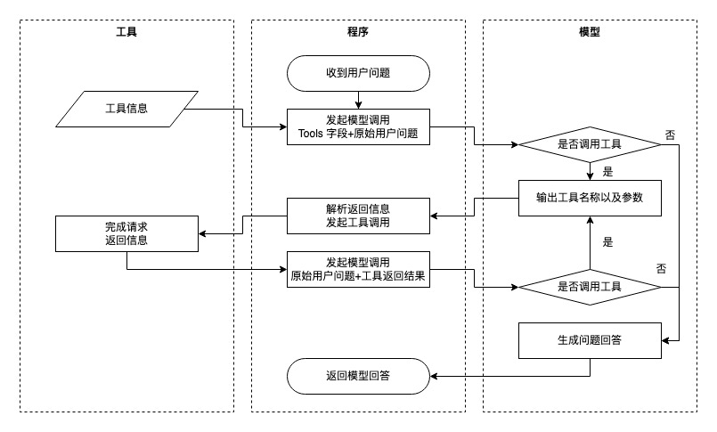
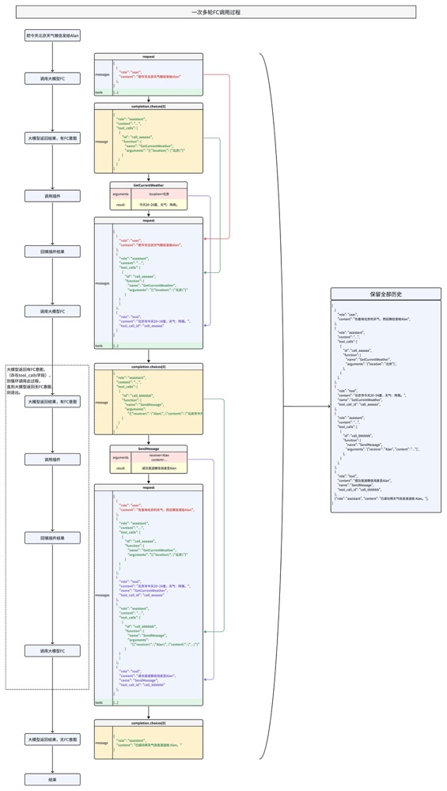

# 函数调用 Function Calling
> 出自 https://www.volcengine.com/docs/82379/1262342

## 工作原理


## 工具定义
```py
{
  "type": "function",
  "function": {
    "name": "get_current_weather",
    "description": "获取指定地点的天气信息，支持摄氏度和华氏度两种单位",
    "parameters": {
      "type": "object",
      "properties": {
        "location": {
          "type": "string",
          "description": "地点的位置信息，例如北京、上海"
        },
        "unit": {
          "type": "string",
          "enum": ["摄氏度", "华氏度"],
          "description": "温度单位，可选值为摄氏度或华氏度"
        }
      },
      "required": ["location"]
    }
  }
}
```
* tools 是一个列表，其中每个元素代表一个工具。这里定义了一个名为 get_current_weather 的函数。
* type：工具的类型，这里是 function，表示这是一个函数调用工具。
* function：包含函数的详细信息，如名称、描述和参数。
* name：函数的名称，即 get_current_weather。
* description：函数的描述，说明该函数用于获取指定地点的天气信息。
* parameters：函数所需的参数，这里是一个对象，包含 * * location 和 unit 两个属性。
* location：地点的位置信息，是一个字符串类型的参数。
* unit：温度单位，是一个字符串类型的参数，可选值为 摄氏度 或 华氏度。
* required：指定必需的参数，这里只有 location 是必需的

## 发起请求
```py
from volcenginesdkarkruntime import Ark

# 从环境变量中获取您的API KEY，配置方法见：https://www.volcengine.com/docs/82379/1399008
api_key = os.getenv('ARK_API_KEY')
# 初始化Ark客户端
client = Ark(
    api_key = api_key,
)

# 用户问题 
messages = [
    {"role": "user", "content": "北京今天的天气如何？"}
]
tools = [
    {
        # 参见步骤1中定义的tools
    }
]
# 发起模型请求
completion = client.chat.completions.create(
    # 替换 <MODEL> 为模型的Model ID
    model="<MODEL>",
    messages=messages,
    tools=tools
)
```


## 多轮fc调用原理
示例流程
* 用户提问：“查询北京的天气，并将结果发送给张三”。
* 第一轮：模型调用 get_current_weather 工具获取北京天气。
* 第二轮：模型调用 send_message 工具将天气结果发送给张三。
* 第三轮：模型总结任务完成情况，返回最终回复。


