# uml类图

# **🎯 核心成员变量含义**

## **线程管理**
- `threads`: 存储所有工作线程的数组
- `thread_count`: 线程池中的线程数量
- `workers_running`: C++17 中控制工作线程是否继续运行

## **任务管理**
- `tasks`: 任务队列，根据是否启用优先级使用不同类型
- `tasks_running`: 当前正在执行的任务数量
- `tasks_mutex`: 保护任务队列的互斥锁

## **同步原语**
- `task_available_cv`: 通知工作线程有新任务可用
- `tasks_done_cv`: 通知等待者所有任务已完成
- `waiting`: 标记是否有线程在等待任务完成

## **功能控制**
- `paused`: 暂停标志，控制是否处理新任务
- `init_func`: 线程创建时的初始化函数
- `cleanup_func`: 线程销毁前的清理函数

# **🔧 方法分类**

## **任务提交方法**
- `detach_*`: 提交任务但不关心结果，适合"发射后不管"的场景
- `submit_*`: 提交任务并返回 future，可以获取结果和等待完成

## **控制方法**
- `pause/unpause`: 动态控制线程池的运行状态
- `reset`: 重新配置线程池（线程数、初始化函数等）
- `purge`: 清空队列中等待的任务

## **查询方法**
- `get_tasks_*`: 获取任务统计信息
- `get_thread_*`: 获取线程相关信息

# **🏗️ 辅助类作用**

## **multi_future**
- 管理多个 `std::future` 对象
- 提供批量等待和结果获取功能
- 简化并行任务的结果处理

## **blocks**
- 智能地将大范围分割成适合并行处理的小块
- 考虑负载均衡，避免某些线程空闲
- 处理不能整除的情况

## **pr_task**
- 将任务和优先级打包
- 提供比较操作符用于优先级队列排序
- 实现任务的优先级调度

## **this_thread**
- 提供线程本地信息（索引、所属线程池）
- 封装操作系统级别的线程操作
- 支持跨平台的线程控制